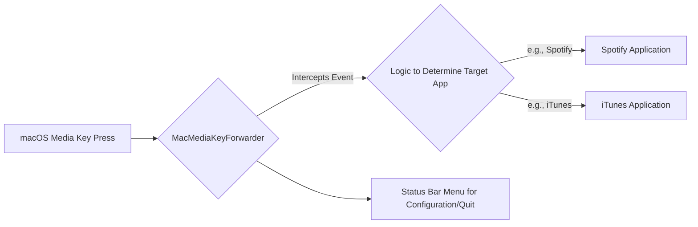

# 1. Project Overview

Welcome to MacMediaKeyForwarder!

## Purpose

MacMediaKeyForwarder is a macOS utility designed to enhance your control over media applications. Its primary function is to intercept media key presses (play/pause, next, previous) and forward these commands to the currently active or user-selected media application. This is particularly useful when macOS default behavior doesn't correctly target the application you intend to control, or when you want more explicit control over which app responds to your media keys.

## Core Functionality

*   **Media Key Interception**: Listens for global media key events on your Mac.
*   **Application Targeting**: Identifies which media application should receive the command. This might be based on the currently active media app or a user-defined preference.
*   **Command Forwarding**: Sends the appropriate command (play, pause, next, previous) to the targeted application. The current version seems to have direct integration with apps like Spotify and iTunes (based on `Spotify.h` and `iTunes.h`).
*   **Status Bar Menu**: Typically, such applications provide a menu in the macOS status bar for configuration and status updates. (This is an assumption based on common patterns for such utilities).

## High-Level Architecture (Conceptual)

The following diagram illustrates the general flow of events in MacMediaKeyForwarder:

**Note:** This is a simplified conceptual diagram. The actual implementation details are in the codebase.

## Future Extensions Context

The plan is to extend this application to:

1.  **Support two new applications**: These will be controlled via "keyboard simulation." This means instead of direct integration (like potentially with Spotify/iTunes), the app will programmatically press the correct keyboard shortcuts in those new target applications.
2.  **Add a new player control approach**: This implies a more flexible or different way to manage how player commands are issued or selected.

Understanding this current architecture will be helpful when thinking about how to integrate these new features.

Next, let's get your [Development Environment Setup](./2_development_environment.md).
